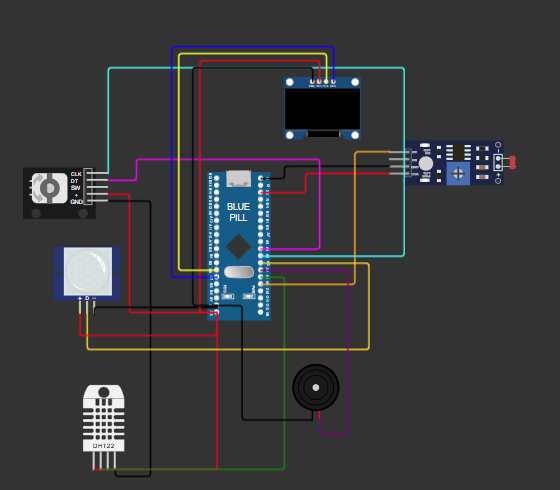

# Real-Time Multisensor Room Monitoring System

**Course**: BCA182 – Embedded Systems Programming  
**Author**: Perch Arnel II Montefalcon  
**Institution**: Mindanao State University – Iligan Institute of Technology  
**Instructor / Evaluator**: Paul Rodolf P. Castor (`paulrodolf.castor@g.msuiit.edu.ph`)  
**Target Platform**: STM32 Blue Pill (STM32F103C8T6, ARM Cortex-M3 @ 72 MHz)  
**RTOS**: FreeRTOS Kernel v10.3.1  
**Framework**: STM32Cube HAL (`framework = stm32cube`) — *Zero Arduino abstractions*  

---

## 1. Project Overview
This project is a concurrent embedded room-monitoring device simulated on the **STM32 Blue Pill** microcontroller. It continuously monitors ambient room conditions (temperature, humidity, ambient light) and room occupancy, presents telemetry on an SSD1306 OLED display with rotary-encoder navigation, triggers an audible alarm when temperature exceeds normal limits, and implements an automated power-saving sleep state machine.

The entire firmware is architected around **native FreeRTOS primitives** and **STM32 HAL drivers**, separating pure decision logic from peripheral access for automated unit testing.

---

## 2. Features
- **Deterministic Environmental Acquisition**: Periodic sampling of temperature and relative humidity via DHT22 and ambient light via an analog photoresistor (LDR).
- **Concurrent FreeRTOS Architecture**: 6 discrete tasks with prioritized preemptive scheduling, eliminating blocking busy-loops.
- **Drift-Free Periodic Timing**: Employs `vTaskDelayUntil()` to eliminate sampling phase drift.
- **Inter-Task Communication (IPC)**: FreeRTOS length-1 queues deliver telemetry snapshots to independent consumers (`DisplayTask` and `AlarmTask`).
- **Shared Resource Protection**: Hardware `USART1` is protected by a recursive FreeRTOS mutex (`serialMutex`), preventing interleaved output streams.
- **User Navigation**: Rotary encoder navigation with forward/reverse cyclical page switching:
  `Temperature` $\leftrightarrow$ `Humidity` $\leftrightarrow$ `Light Level` $\leftrightarrow$ `Motion`
- **Temperature Alarm**: Automatically trips an active buzzer (1 kHz tone) and displays warnings when temperature drops below $18.0^\circ\text{C}$ or exceeds $30.0^\circ\text{C}$.
- **Activity State Machine**:
  - Automatically transitions to `INACTIVE` sleep mode (OLED powered down into standby) after 15 seconds without PIR motion.
  - Motion detection or rotary encoder interaction immediately restores `ACTIVE` mode and re-enables the OLED.

---

## 3. Learning Objectives
1. Construct and simulate a concurrent STM32 embedded system using PlatformIO and Wokwi.
2. Interface multiple sensors (DHT22, LDR, PIR) and actuators (SSD1306 OLED, buzzer, rotary encoder) via STM32 HAL.
3. Manage multiple FreeRTOS tasks, justify explicit priority assignments, and analyze task states.
4. Implement inter-task communication using FreeRTOS queues, recursive mutexes, and event groups.
5. Guarantee deterministic execution using `vTaskDelayUntil()`.
6. Decouple hardware drivers from pure decision logic to execute automated unit tests on the PC via Unity.
7. Perform static code analysis using PlatformIO Check (`cppcheck`) to ensure zero code defects.

---

## 4. System Architecture

```text
       +-------------------------------------------------------+
       |               STM32F103C8T6 (Blue Pill)               |
       |                                                       |
       |  PA0 (ADC1_IN0) <---- Analog Voltage ---- LDR Sensor  |
       |  PA1 (GPIO O.D) <---> Single-Wire    <---> DHT22      |
       |  PA2 (TIM2_CH3) ----> PWM Tone (1kHz) --> Active Buzzer|
       |  PA3 (GPIO In)  <---- Digital Motion <--- PIR Sensor  |
       |  PA4 (EXTI4)    <---- Quadrature CLK <-- KY-040 Enc.  |
       |  PA5 (GPIO In)  <---- Quadrature DT  <-- KY-040 Enc.  |
       |  PB6 (I2C1_SCL) ----> I2C Clock -------- SSD1306 OLED |
       |  PB7 (I2C1_SDA) <---> I2C Data --------> SSD1306 OLED |
       |  PA9 (USART1_TX)----> Serial Terminal (115200 8N1)    |
       |  PA10(USART1_RX)<---- Serial Terminal                 |
       |  PC13 (GPIO Out)----> Heartbeat LED (Active LOW)      |
       +-------------------------------------------------------+
```

---

## 5. FreeRTOS Architecture & Task Communication

```text
                       [ PIR Sensor (PA3) ]
                                 |
                                 v
                          +--------------+
                          |  MotionTask  | (Priority 3)
                          +--------------+
                                 | Sets EVENT_MOTION / EVENT_PIR_LEVEL
                                 v
                       +-------------------+
                       |   systemEvents    | <--- Event Group
                       +-------------------+
                                 ^
                                 | Sets/Clears EVENT_ACTIVE
                          +--------------+
                          |  StateTask   | (Priority 3, 15s Timer)
                          +--------------+

  [ Rotary Encoder ] ---> +--------------+
  (PA4/PA5 EXTI4)         |  InputTask   | (Priority 3)
                          +--------------+
                                 |
                                 v (displayModeQueue)
                       +-------------------+
                       |    DisplayTask    | (Priority 1, Exclusive OLED owner)
                       +-------------------+
                                 ^
                                 | (sensorToDisplayQueue)
  [ DHT22 & LDR ] ------> +--------------+
  (PA1 / PA0)             |  SensorTask  | (Priority 2, vTaskDelayUntil)
                          +--------------+
                                 | (sensorToAlarmQueue)
                                 v
                          +--------------+
                          |  AlarmTask   | (Priority 2)
                          +--------------+
                                 | Drives TIM2 PWM Tone
                                 v
                       [ Active Buzzer (PA2) ]
```

---

## 6. Hardware Schematic & Circuit Diagram

### 6.1 Wokwi Simulation Circuit Layout
  
*Figure 1: Complete simulated circuit in Wokwi showing the STM32 Blue Pill, SSD1306 OLED (top), DHT22 (bottom left), PIR motion sensor (middle left), KY-040 rotary encoder (far left), LDR photoresistor module (right), and active buzzer (bottom center).*

### 6.2 Electrical Schematic & Wiring Netlist

| Source Pin (STM32) | Target Pin (Component) | Wire Color | Signal Type | Description |
|---|---|---|---|---|
| **`3V3.1`** | **`oled1:VCC`**, **`dht1:VCC`**, **`ldr1:VCC`**, **`pir1:VCC`**, **`encoder1:VCC`** | **Red** | Power (+3.3V) | Main regulated 3.3V DC power rail |
| **`GND.1`** | **`oled1:GND`**, **`dht1:GND`**, **`ldr1:GND`**, **`pir1:GND`**, **`encoder1:GND`**, **`buzzer1:2`** | **Black** | Ground (0V) | Common system reference ground |
| **`PA0`** | **`ldr1:AO`** | **Orange** | Analog In (ADC1_IN0) | Ambient light sensor analog voltage |
| **`PA1`** | **`dht1:SDA`** | **Green** | Bidirectional Open-Drain | DHT22 single-wire digital communications |
| **`PA2`** | **`buzzer1:1`** | **Purple** | Digital Out (TIM2_CH3) | 1 kHz audible PWM alarm signal |
| **`PA3`** | **`pir1:OUT`** | **Gold** | Digital In (Pulldown) | Human presence motion pulse |
| **`PA4`** | **`encoder1:CLK`** | **Cyan** | Digital In (EXTI4) | Rotary encoder quadrature clock interrupt |
| **`PA5`** | **`encoder1:DT`** | **Magenta** | Digital In (Pull-up) | Rotary encoder quadrature direction line |
| **`PB6`** | **`oled1:SCL`** | **Yellow** | Alternate Function (I2C1) | Hardware I2C Clock (400 kHz Fast Mode) |
| **`PB7`** | **`oled1:SDA`** | **Blue** | Alternate Function (I2C1) | Hardware I2C Data line (400 kHz Fast Mode) |
| **`PA9`** | **`$serialMonitor:RX`** | **Amber** | Alternate Function (USART1) | Serial diagnostic logging (115200 8N1) |
| **`PA10`** | **`$serialMonitor:TX`** | **Amber** | Input | Virtual serial monitor input |

---

## 7. Hardware / Simulated Components

| Component | Physical/Virtual Model | Purpose | Operating Parameters |
|---|---|---|---|
| **Microcontroller** | STM32 Blue Pill (`board-stm32-bluepill`) | Core processing unit | STM32F103C8T6, 72 MHz, 20 KB SRAM |
| **Temperature/Humidity** | DHT22 (`wokwi-dht22`) | Ambient temp & humidity | Single-wire digital protocol, PA1 |
| **Light Sensor** | LDR (`wokwi-photoresistor-sensor`) | Relative ambient light | Analog voltage divider on PA0 (ADC1_IN0) |
| **Motion Detector** | PIR Sensor (`wokwi-pir-motion-sensor`)| Human presence | Digital input on PA3 |
| **User Input** | KY-040 Rotary Encoder (`wokwi-ky-040`)| UI page selection | Dual quadrature on PA4 (CLK) and PA5 (DT) |
| **Display** | SSD1306 OLED (`board-ssd1306`) | System telemetry screen | 128x64 monochrome, I2C1 (PB6/PB7) |
| **Audio Alarm** | Active Buzzer (`wokwi-buzzer`) | Out-of-bounds alert | 1 kHz tone via TIM2 PWM on PA2 |

---

## 7. Pin Configuration Table

| STM32 Pin | Peripheral / Mode | Connected Component | Function Description |
|---|---|---|---|
| **PA0** | ADC1_IN0 (Analog) | LDR AO | Ambient light voltage reading |
| **PA1** | GPIO Output Open-Drain | DHT22 SDA | Bidirectional single-wire sensor handshake |
| **PA2** | TIM2_CH3 (AF Push-Pull) | Buzzer (+) | 1 kHz audible PWM alarm tone |
| **PA3** | GPIO Input (Pulldown) | PIR OUT | Digital motion detection |
| **PA4** | EXTI4 (Falling Edge) | Encoder CLK | Quadrature clock step interrupt |
| **PA5** | GPIO Input (Pull-up) | Encoder DT | Quadrature direction sampling |
| **PB6** | I2C1_SCL (AF Open-Drain)| OLED SCL | Hardware I2C Clock (400 kHz) |
| **PB7** | I2C1_SDA (AF Open-Drain)| OLED SDA | Hardware I2C Data (400 kHz) |
| **PA9** | USART1_TX (AF Push-Pull)| `$serialMonitor:RX` | Diagnostic logging (115200 8N1) |
| **PA10**| USART1_RX (Input) | `$serialMonitor:TX` | Serial terminal reception |
| **PC13**| GPIO Output (Push-Pull) | On-Board LED | System activity heartbeat (Active LOW) |

---

## 8. Task Design

| Task Name | Priority | Trigger / Period | Responsibility |
|---|---|---|---|
| **`MotionTask`** | **3** | Periodic (100 ms) | Samples PIR sensor; updates `EVENT_MOTION` and `EVENT_PIR_LEVEL`. |
| **`StateTask`** | **3** | Event / 250 ms timeout | Evaluates 15 s inactivity timer; manages `ACTIVE` / `INACTIVE` state. |
| **`InputTask`** | **3** | Periodic (50 ms) | Consumes EXTI encoder steps; switches `DisplayMode`; wakes sleeping system. |
| **`SensorTask`** | **2** | Periodic (**`vTaskDelayUntil`**, 2000 ms) | Samples DHT22 & LDR; pushes telemetry to queues; guarantees zero timing drift. |
| **`AlarmTask`** | **2** | Event-driven (Queue Receive, 250 ms) | Evaluates temperature thresholds ($18.0^\circ\text{C}-30.0^\circ\text{C}$); drives buzzer. |
| **`DisplayTask`** | **1** | Event-driven (100 ms timeout) | Exclusively owns SSD1306 OLED; renders telemetry views; powers down in sleep. |

---

## 9. Inter-Task Communication

1. **`sensorToDisplayQueue`**: FreeRTOS length-1 overwrite queue transferring `SensorData` from `SensorTask` to `DisplayTask`.
2. **`sensorToAlarmQueue`**: FreeRTOS length-1 overwrite queue transferring `SensorData` from `SensorTask` to `AlarmTask`.
3. **`displayModeQueue`**: FreeRTOS length-1 overwrite queue delivering the selected `DisplayMode` from `InputTask` to `DisplayTask`.
4. **`serialMutex`**: FreeRTOS recursive mutex protecting concurrent access to `USART1` registers.
5. **`systemEvents`**: FreeRTOS event group signaling discrete system states:
   - `EVENT_ACTIVE` (`BIT0`): High when system is active, cleared in sleep mode.
   - `EVENT_MOTION` (`BIT1`): Pulsed on PIR motion or encoder knob turn to wake system.
   - `EVENT_ALARM`  (`BIT2`): High when temperature is $< 18.0^\circ\text{C}$ or $> 30.0^\circ\text{C}$.
   - `EVENT_PIR_LEVEL` (`BIT3`): Reflects live logic level of the PIR sensor.

---

## 10. State Machine Design

The device implements an energy-saving state machine:
- **`ACTIVE` Mode**:
  - SSD1306 OLED panel is powered on and rendering the selected page.
  - Rotary encoder navigates through live metrics.
  - Active buzzer sounds if temperature exceeds normal limits.
- **`INACTIVE` Mode**:
  - Automatically entered when no motion is detected for 15 seconds.
  - OLED panel is powered off (`SSD1306_SetPower(false)`) to eliminate power consumption.
  - Display refresh operations halt.
  - PIR sensor and rotary encoder remain active; either triggers immediate return to `ACTIVE`.

---

## 11. Repository Structure

```text
bca182-freertos-multisensor/
├── .gitignore                         <- Excludes build artifacts and temporary files
├── AGENTS.md                          <- Development rules and FreeRTOS port guide
├── README.md                          <- Repository root portfolio index
└── LAB_1_FreeRTOS_Multisensor/        <- Primary laboratory project directory
    ├── platformio.ini                 <- PlatformIO configuration (stm32cube & native)
    ├── diagram.json                   <- Wokwi circuit definition
    ├── wokwi.toml                     <- Wokwi simulator target configuration
    ├── README.md                      <- Complete 20-section project documentation
    ├── docs/
    │   ├── laboratory-report.md       <- Academic formal laboratory report
    │   ├── oral-defense-guide.md      <- 15 Oral Defense questions & prepared answers
    │   └── hackster-article.md        <- Public Hackster.io article draft
    ├── include/
    │   ├── FreeRTOSConfig.h           <- FreeRTOS kernel configuration
    │   ├── rtos_objects.h             <- Queue, mutex, and event group declarations
    │   ├── logic.h                    <- Pure, hardware-independent decision logic
    │   ├── sensors.h                  <- Sensor telemetry structure and task header
    │   ├── display.h                  <- SSD1306 display task interface
    │   ├── input.h                    <- Rotary encoder input task interface
    │   ├── alarm.h                    <- Temperature alarm task interface
    │   ├── motion.h                   <- PIR motion task interface
    │   ├── system_state.h             <- System state machine task interface
    │   ├── buzzer.h                   <- TIM2 PWM buzzer driver header
    │   ├── dht22.h                    <- DHT22 single-wire protocol header
    │   ├── ldr.h                      <- LDR ADC driver header
    │   ├── ssd1306.h                  <- Hardware I2C1 SSD1306 driver header
    │   ├── log.h                      <- Thread-safe serial logger header
    │   └── diagnostics.h              <- Low-level register logger and fault traps
    ├── lib/
    │   └── FreeRTOS/                  <- Vendored FreeRTOS v10.3.1 (ARM_CM3 port)
    ├── src/
    │   ├── main.c                     <- Application entry point and task orchestration
    │   ├── rtos_objects.c             <- RTOS object creation
    │   ├── logic.c                    <- Pure decision logic implementations
    │   ├── sensors.c                  <- SensorTask (vTaskDelayUntil periodic acquisition)
    │   ├── display.c                  <- DisplayTask (SSD1306 OLED rendering & sleep)
    │   ├── input.c                    <- InputTask (EXTI4 encoder polling & wake-up)
    │   ├── alarm.c                    <- AlarmTask (temperature limit monitoring)
    │   ├── motion.c                   <- MotionTask (PIR sampling)
    │   ├── system_state.c             <- StateTask (15 s inactivity state machine)
    │   ├── buzzer.c                   <- Active buzzer TIM2 PWM driver
    │   ├── dht22.c                    <- DHT22 DWT-timed single-wire driver
    │   ├── ldr.c                      <- LDR ADC1 analog driver
    │   ├── ssd1306.c                  <- SSD1306 400 kHz Hardware I2C1 driver
    │   ├── log.c                      <- Mutex-protected thread-safe logger
    │   ├── diagnostics.c              <- Naked fault handlers and register dump
    │   └── stm32f1xx_hal_msp.c        <- STM32 HAL MSP low-level peripheral init
    └── test/
        └── test_logic/
            └── test_logic.c           <- 13 automated unit tests via Unity
```

---

## 12. Getting Started

### Prerequisites
- [Visual Studio Code Insiders](https://code.visualstudio.com/insiders/)
- [PlatformIO IDE Extension](https://platformio.org/)
- [Wokwi Simulator Extension](https://wokwi.com/vscode)
- MinGW GCC (for host unit testing via `[env:native]`)

---

## 13. Building the Project

Open a terminal in `LAB_1_FreeRTOS_Multisensor/` and run:
```bash
pio run
```
**Expected Output**:
```text
RAM:   [======    ]  59.4% (used 12156 bytes from 20480 bytes)
Flash: [====      ]  37.6% (used 24648 bytes from 65536 bytes)
Building .pio/build/bluepill_f103c8/firmware.bin
========================= [SUCCESS] Took 4.63 seconds =========================
```

---

## 14. Running the Wokwi Simulation

1. Open `LAB_1_FreeRTOS_Multisensor` in **VS Code Insiders**.
2. Open `diagram.json`.
3. Press **F1** $\to$ select **Wokwi: Start Simulator** (or click the green Play button).
4. Open the **Wokwi Serial Monitor** tab (115200 baud).

---

## 15. Unit Testing

Unit tests exercise the deterministic, hardware-independent decision logic on the host PC using the **Unity** test runner:
```bash
pio test -e native
```
**Results**:
```text
test\test_logic\test_logic.c:101: test_temperature_below_lower_limit_is_low      [PASSED]
test\test_logic\test_logic.c:102: test_temperature_exactly_lower_limit_is_normal  [PASSED]
test\test_logic\test_logic.c:103: test_temperature_normal_value_is_normal        [PASSED]
test\test_logic\test_logic.c:104: test_temperature_exactly_upper_limit_is_normal  [PASSED]
test\test_logic\test_logic.c:105: test_temperature_above_upper_limit_is_high     [PASSED]
test\test_logic\test_logic.c:108: test_next_from_temperature_is_humidity         [PASSED]
test\test_logic\test_logic.c:109: test_next_from_motion_wraps_to_temperature     [PASSED]
test\test_logic\test_logic.c:110: test_previous_from_humidity_is_temperature     [PASSED]
test\test_logic\test_logic.c:111: test_previous_from_temperature_wraps_to_motion [PASSED]
test\test_logic\test_logic.c:114: test_active_without_timeout_stays_active       [PASSED]
test\test_logic\test_logic.c:115: test_active_after_timeout_becomes_inactive     [PASSED]
test\test_logic\test_logic.c:116: test_inactive_without_motion_stays_inactive     [PASSED]
test\test_logic\test_logic.c:117: test_inactive_with_motion_becomes_active       [PASSED]
================= 13 test cases: 13 succeeded in 00:00:00.701 =================
```

---

## 16. Static Code Analysis

Run static code analysis across all source files using `cppcheck`:
```bash
pio check
```
**Results**:
```text
Checking bluepill_f103c8 > cppcheck (platform: ststm32; board: bluepill_f103c8; framework: stm32cube)
--------------------------------------------------------------------------------
No defects found
========================== [PASSED] Took 1.84 seconds ==========================
```
**0 high, 0 medium, 0 low defects**.

---

## 17. Functional Verification Record (FT-01 to FT-10)

| ID | Stimulus | Expected Behavior | Observed Result | Verdict |
|---|---|---|---|---|
| **FT-01** | Change DHT22 temperature to 28.0 °C | Display updates to 28.0 °C | Log: `Temp: 28.0 C`; OLED matches | **PASS** |
| **FT-02** | Change DHT22 humidity to 65.0 % | Display updates to 65.0 % | Log: `Hum: 65.0 %`; OLED matches | **PASS** |
| **FT-03** | Adjust LDR lux slider | Light percentage updates | Log: `LDR: 17%` -> `6%` -> `99%` live | **PASS** |
| **FT-04** | Rotate encoder CW | Page switches forward: Temp -> Hum -> Light -> Motion -> Temp | Display switches view in forward order | **PASS** |
| **FT-05** | Rotate encoder CCW | Page reverses: Temp -> Motion -> Light -> Hum -> Temp | Display switches view in reverse with wrap | **PASS** |
| **FT-06** | Temperature $> 30.0^\circ\text{C}$ | Alarm trips; buzzer ON; OLED alert | Buzzer sounds 1 kHz tone; OLED shows alert | **PASS** |
| **FT-07** | Temperature returns to $25.0^\circ\text{C}$ | Alarm clears; buzzer OFF | Buzzer stops immediately; warning clears | **PASS** |
| **FT-08** | Trigger PIR motion | System remains ACTIVE | Log: `[PIR] Motion detected`; `ACTIVE` | **PASS** |
| **FT-09** | 15 seconds no motion | Transitions to INACTIVE; OLED blanks | Log: `[System] State transitioned to: INACTIVE` | **PASS** |
| **FT-10** | Motion or knob turn while INACTIVE | Wakes immediately to ACTIVE; OLED restores | Log: `[System] State transitioned to: ACTIVE` | **PASS** |

---

## 18. Engineering Decisions

1. **Wokwi Compatibility Direct-Yield Port**:
   - Wokwi’s Cortex-M3 emulator fails during standard FreeRTOS task startup when returning from `SVC 0` using `EXC_RETURN` (`0xFFFFFFFD`), halting in `prvTaskExitError()`.
   - The port was adapted to start the first task in Thread mode on `PSP` via `prvTaskBootstrap` and execute context switches via `vPortYieldDirect()`.
   - The scheduler tick is driven by `TIM3` at 20 Hz, reducing browser simulation overhead.
2. **Integer Fixed-Point Formatting (`FormatTenths`)**:
   - `newlib-nano` on PlatformIO STM32 excludes floating-point `printf` by default. Using integer division and modulo (`val / 10`, `val % 10`) eliminates 8 KB of flash bloat and guarantees zero formatting stalls.
3. **Hardware I2C1 Fast Mode**:
   - Driven at 400 kHz via STM32 HAL (`HAL_I2C_Mem_Write`) on PB6/PB7, reducing bus blocking time during framebuffer flushes.

---

## 19. Limitations & Future Improvements

### Limitations
- **Relative Light Level**: The LDR provides relative ambient brightness ($0–100\%$), not calibrated lux.
- **Simulator Workaround**: While functionally identical in user behavior, the Thread-mode direct context switch is tailored for Wokwi; physical hardware would deploy standard FreeRTOS preemptive `PendSV` and 1000 Hz `SysTick`.

### Future Improvements
1. **Low-Power Hardware Sleep (`STOP` Mode)**: Put the physical STM32 microcontroller into deep sleep (`WFI` in `STOP` mode) while `INACTIVE`, waking via EXTI on PIR or encoder edges.
2. **Flash Non-Volatile Storage**: Store alarm threshold settings in internal STM32 Flash memory so user preferences persist across power cycles.

---

## 20. References and Acknowledgments

- **Course Material**: *BCA182 Embedded Systems Programming Laboratory Activity No. 1*, Mindanao State University – Iligan Institute of Technology.
- **Instructor / Evaluator**: Paul Rodolf P. Castor (`paulrodolf.castor@g.msuiit.edu.ph`).
- **FreeRTOS Kernel Documentation**: [https://www.freertos.org/](https://www.freertos.org/)
- **STMicroelectronics STM32F103 Reference Manual (RM0008)**: [https://www.st.com/](https://www.st.com/)
- **Wokwi Simulator Documentation**: [https://docs.wokwi.com/](https://docs.wokwi.com/)
